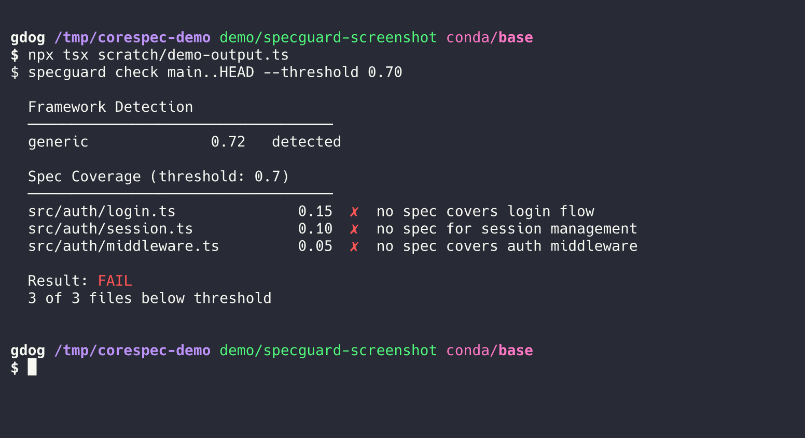
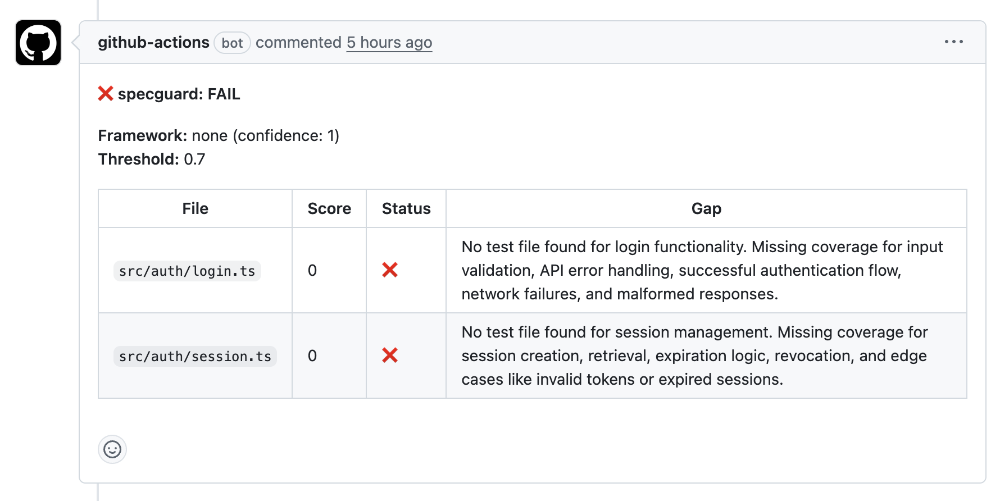
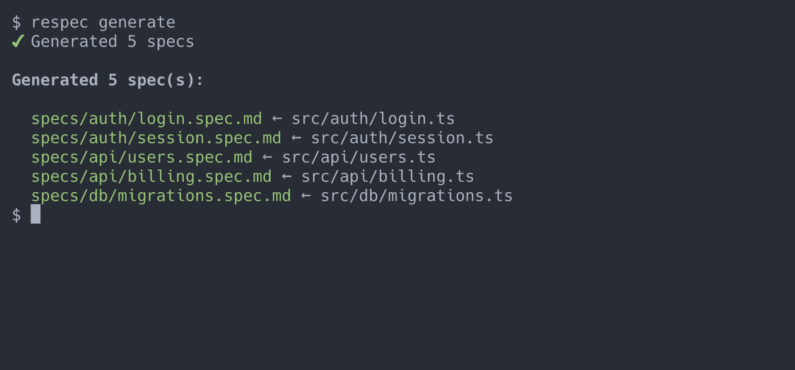
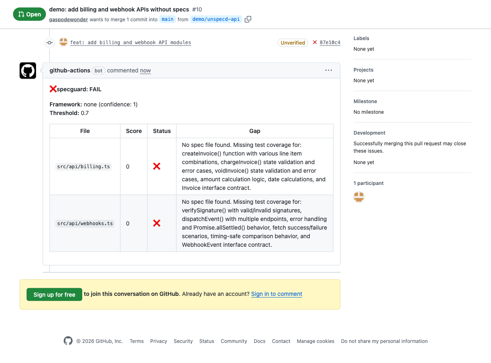
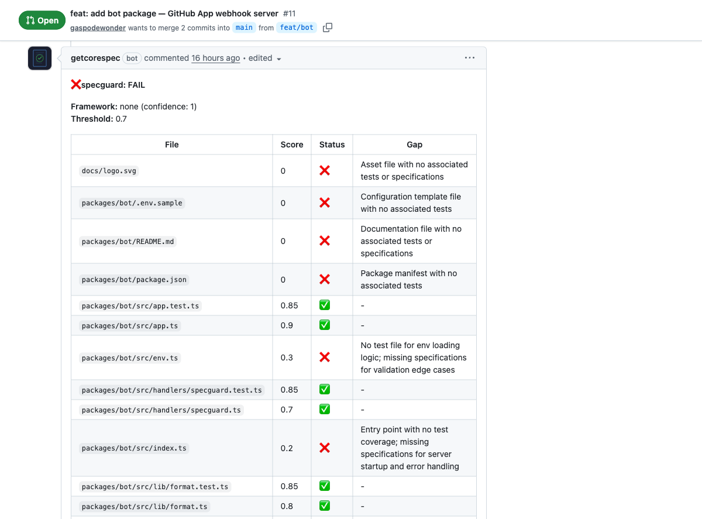
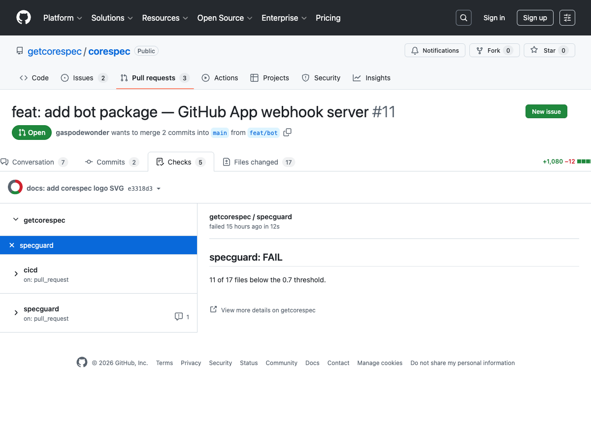

  <h2 align="center"><code>corespec</code></h2>
  <h3 align="center">Spec-driven development tools for existing codebases.</h3>
  

    
    
  

## Packages

### [corespec](./packages/corespec/)

Shared foundation library. Spec framework detection, LLM integration, GitHub API helpers, and common utilities that respec and specguard build on.

### [specguard](./packages/specguard/)

PR gating for specs. Checks that code changes have an associated specification before merge. Built on corespec.

  
  

### [respec](./packages/respec/)

Retroactive spec generation. Analyzes existing code and PRs to generate structured specifications. Built on corespec.

  
  

### [bot](./packages/bot/)

GitHub App that runs specguard on your pull requests automatically. Install it and every PR gets a spec coverage report.

  
  

> **Get started instantly:** [Install the corespec GitHub App](https://github.com/apps/getcorespec) — no config needed.
